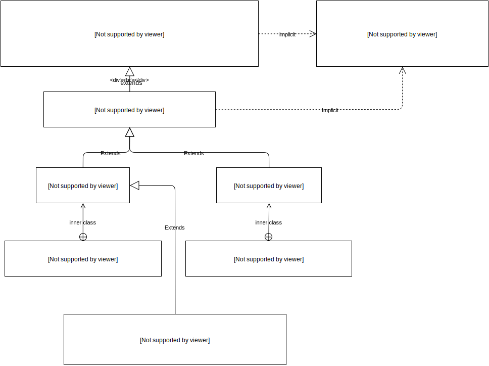

In this article, I would like to analyze the architecture of Shapeless' polymorphic functions and their inner workings.

If you are new to Shapeless, you may want to read the first article of the series: [Learning Shapeless: HLists](http://akmetiuk.com/blog/2016/09/30/learning-shapeless-hlists.html).

This article does not aim to introduce polymorphic functions or provide a motivation for their usage. Its main focus is to understand how the machinery behind them works. If you are new to the concept of polymorphic functions, I recommend to read the following excellent articles by Miles Sabin before proceeding with this article:

- [First-class polymorphic function values in shapeless (1 of 3) — Function values in Scala](https://milessabin.com/blog/2012/04/27/shapeless-polymorphic-function-values-1/)
- [First-class polymorphic function values in shapeless (2 of 3) — Natural Transformations in Scala](https://milessabin.com/blog/2012/05/10/shapeless-polymorphic-function-values-2/)

# Core principles
To better see the core ideas behind Shapeless' `Poly`s, let us try to implement them *ad hoc*, without any imports from Shapeless.

```scala
object AdHocPoly extends App {
  trait Case[F, In] {
    type Out
    def apply(x: In): Out
  }

  trait Poly {
    def apply[T](x: T)(implicit cse: Case[this.type, T]): cse.Out = cse(x)
  }

  object f extends Poly {
    implicit val intCase = new Case[f.type, Int] {
      type Out = String
      def apply(x: Int) = "It works! " * x
    }

    implicit val stringCase = new Case[f.type, String] {
      type Out = Int
      def apply(x: String) = x.length
    }
  }

  println(f(3))      // It Works! It Works! It Works!
  println(f("Foo"))  // 3
}
```

A polymorphic function has an ability to be called with arguments of different types, possibly also returning values of different types.

Shapeless' `Poly` treats an execution on an argument from a particular domain `In` as a *behaviour* on that domain: every value `v: In` can be executed with a certain result of type `Out`. This means it can be encapsulated into a type class - a `Case[In]`. Then, to call a function on some arbitrary type `T`, one needs to implicitly look up the type class `Case[T]` and delegate the work (including determination of the result type of the computation) to it - this is how the `apply` method of `Poly` works.

To separate implicit `Case` instances of one `Poly` from those of the others, `Case`s are further parameterised by the singleton type of the `Poly` they belong to: `Case[F, In]`. The `Poly` trait's `apply` method requires an implicit `Case` of the singleton type of that exact `Poly`. This way, it is not possible to use a `Case[f.type, _]` to call any other function but `f`, because only `f` accepts a `Case` parameterised by `f.type`. You can think of it as a kind of a mark of ownership, tagging a `Case` as a property of a certain `Poly`.

Parameterising `Case`s with the type of the `Poly` they belong to has one more benefit: it is not even needed to import implicit `Case`s before calling a `Poly` that requires them. This is due to  the fact that the compiler looks for the implicits in the companion objects of the types of the implicit arguments, as well as the companions of their type parameters. For example, `implicitly[Foo[A, B]]` will look for an implicit of this type in the companions of `Foo`, `A` and `B`. Hence, `Case[f.type, In]` will look into the companions of `Case`, `f.type` (which is simply `f`) and `In`. So, if the `Case`s are always defined in the bodies of the `Poly`s they belong to, they will always be found by the implicit search when we call these `Poly`s.

For further reading on the rules of how implicits are resolved, see [export-hook readme](https://github.com/milessabin/export-hook#what-are-orphan-type-class-instances).


# Architecture
Now let us see how the ideas described above are implemented in Shapeless.

## File base
Let us first understand which sources define the polymorphic functions. We will be looking at two root directories:

- `core/src/main/scala/shapeless/` - `core` - the human-written sources, available online [here](https://github.com/milessabin/shapeless/tree/master/core/src/main/scala/shapeless).
- `core/jvm/target/scala-2.11/src_managed/main/shapeless` - `synthetic` - the machine generated sources that are produced on compilation. To gain access to them, clone the repository of Shapeless and compile it via `sbt compile`. The motivation to have `synthetic` is that it contains various code for entities of different arities, which is largely boilerplate. Just open a few files from `synthetic` and look through them - you will quickly notice a pattern where each of the files contain many similar entities that vary only in the number of their arguments. It is not very efficient to define these by hand, so they are generated automatically by SBT before the compilation starts.

Now let us look at the files that are of interest to us, referring for simplicity to the roots above as `core` and `synthetic` respectively:

- [`core/poly.scala`](https://github.com/milessabin/shapeless/blob/master/core/src/main/scala/shapeless/poly.scala) - most of the definitions related to the polymorphic functions.
- `synthetic/polyapply.scala` - `PolyApply` trait.
- `synthetic/polyntraits.scala` - traits of the form `PolyN`, where `N` is a number between 1 and 22.
- [`build.sbt`](https://github.com/milessabin/shapeless/blob/master/build.sbt) and [`project/Boilerplate.scala`](https://github.com/milessabin/shapeless/blob/master/project/Boilerplate.scala) - these two define how the synthetic sources are generated. `Boilerplate.scala` defines the templates and the generation logic, and `build.sbt` references this file. Although they are not directly relevant to the polymorphic functions is Shapeless, it is good to the mechanics behind the synthetic sources generation.

## Entities


### Poly
The base class for all the polymorphic functions is `Poly`, located in `core/poly.scala`. Together with synthetic `PolyApply` (see the diagram above), its main job is to provide a bunch of `apply` methods for calls of different number of arguments. The methods expect the actual logic of the calls to be defined in the form of `Case` type classes that should be available implicitly. Note how each `Poly` has `apply`s of all the possible arities, so it is possible to define one `Poly` to be called with different number of arguments.

One can also think of this as of a polymorphism not only on the types, but on the cartesian products of the types, expressed in the form of `HList`s. For example, one can argue that a cartesian product of `A` and `B` can be represented with a `HList` `A :: B :: HNil`. In standard Scala library, products are represented as tuples, so a product of `A` and `B` is `(A, B)`.

### Case
`Case` is a trait defined in `core/poly.scala`. Its main highlight is a function `val value: L => Result`. It represents the logic of a `Poly` call on certain arguments `L` that returns a value of type `Result`. Note how `L <: HList`. This is done so that cases of different arity can be represented with the same trait. For example, a function of one argument can be represented as `A :: HNil => Result` (instead of `A => Result`), of two arguments - `A :: B :: HNil => Result` (instead of `(A, B) => Result`) and so on.

### PolyN
It may be not convenient to define `Case`s by hand using anonymous classes. Most of the time you want them to be derived from a function. Traits `Poly1` through `Poly22` exist for this reason. Located at `synthetic/polyntraits.scala`, they represent polymorphic functions of a certain arity. Their main highlights are a `CaseBuilder` nested class which specialise on `Case` production, and an `at` method to quickly get access to it. `CaseBuilder` has an `apply` method to produce `Case`s from a function, so in practice it looks like this:

```scala
implicit val caseInt: poly.Case[this.type, Int] = at[Int] { x: Int => x * 2 }
```
Much more concise than, say, this:

```scala
implicit val caseInt = new poly.Case[f.type, Int] {
  type Out = Int
  def apply(x: Int) = x * 2
}
```

### Natural transformations ~>
Finally, one more trait worth attention is `~>`, which is located in `core/poly.scala`. It exists to support [natural transformations](https://en.wikipedia.org/wiki/Natural_transformation) and its main highlight is an abstract `def apply[T](f : F[T]) : G[T]`. Note how in order to define a `~>` you do not need to provide implicit `Case`s, but only to implement that `apply` method. An implicit `Case`, `caseUniv` is provided by the trait and delegates the work to the implemented `apply` method.

# Usage
Let us see how our ad-hoc example from the "Core Principles" paragraph will look like in Shapeless:

```scala
object ShapelessPoly extends App {
  import shapeless._
  import poly._

  object f extends Poly1 {
    implicit val intCase    = at[Int   ] { x => "It Works! " * x}
    implicit val stringCase = at[String] { x => x.length        }
  }

  println(f(3))      // It Works! It Works! It Works!
  println(f("Foo"))  // 3
}
```

Since we want a function defined on one argument, we extend `Poly1` to bring in scope the convenience method `at` to build the corresponding `Case`s. The two `Case`s are for `Int` and `String` input arguments. When we call `at[T]`, we create a `CaseBuilder[T]`. When we call `apply(T => Result)` on it, a `Case[this.type, T]` is produced.

In the `main` method, we call `f` twice. Each time, we invoke this method in `PolyApply`:

```scala
def apply[A](a:A)(implicit cse : Case[this.type, A::HNil]): cse.Result = cse(a::HNil)
```

This method requires an implicit `Case` in scope. Among other things,  the compiler looks for it in the companion of `this.type`, since this is a type parameter of the type of the implicit argument in question. The companion of `this.type` is `this`, which is `object f`. This object contains the required implicit `Case`s for each call. After the `Case` is found, the work of executing the call is delegated to this type class.

# Summary
The idea behind the `Poly` implementation in Shapeless is to encapsulate the execution logic in type classes for every case of input types. Hence, a concrete polymorphic function is most often implemented as an `object` that extends `Poly` and contains all the type classes for all the types this function is defined on.

The base framework of polymorphic functions is represented by the `Poly` trait, which represents the function, and the `Case` type class, which knows how to proceed with the call execution.

Besides these basic traits, Shapeless provides a set of conveniences. These include `PolyN` traits to simplify implementation of N-ary polymorphic functions and `~>` trait for natural transformations. Other conveniences not covered here are also available under `core/poly.scala`.