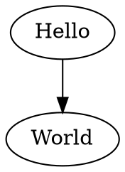
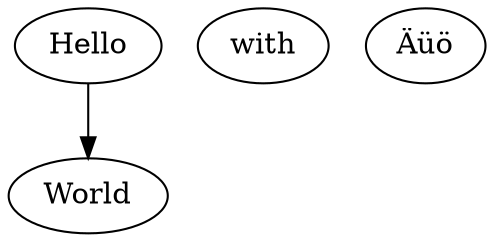

This is the third part of my progress report on a rewriting-based implementation of [SubScript](https://github.com/scala-subscript/subscript), [FreeACP](https://github.com/anatoliykmetyuk/free-acp). This part covers the architecture of FreeACP I came up with so far while implementing the rewriting engine for SubScript.

If you have not read the previous parts of this report, you are advised to do so before reading this one:

The most interesting part of the engine is the resumption:

$\frac{-b\pm\sqrt{b^2-4ac}}{2a}$

```{.scala include=../code/matryoshka-intro/src/main/scala/matryoshkaintro/Main.scala snippet=cool-thingy}
```

```scala
def foo(x: Int) = bar
```

Use this


```
digraph G {Hello->World}
```

to get



with with Äüö



See [(this is a link to whatever)](#whatever) for an example with options `{.graphviz #whatever caption="this is the caption" width=35%}`:

```{.graphviz #whatever caption="this is the caption" width=35%}
digraph G {Hello->World}
```

Use this


```
Alice -> Bob: Authentication Request
Bob --> Alice: Authentication Response

Alice -> Bob: Another authentication Request
Alice <-- Bob: another authentication Response
```

to get

```plantuml
Alice -> Bob: Authentication Request
Bob --> Alice: Authentication Response

Alice -> Bob: Another authentication Request
Alice <-- Bob: another authentication Response
```

with Äüö

```plantuml
Älöc -> Bob: Authentication Request
Bob --> Älöc: Authentication Response

Älöc -> Bob: Another authentication Request
Älöc <-- Bob: another authentication Response
```

See [(this is a link to whatever)](#whatever) for an example with options `{.plantuml #whatever caption="this is the caption" width=65%}`

```{.plantuml #whatever caption="this is the caption" width=65%}
Alice -> Bob: Authentication Request
Bob --> Alice: Authentication Response
```
