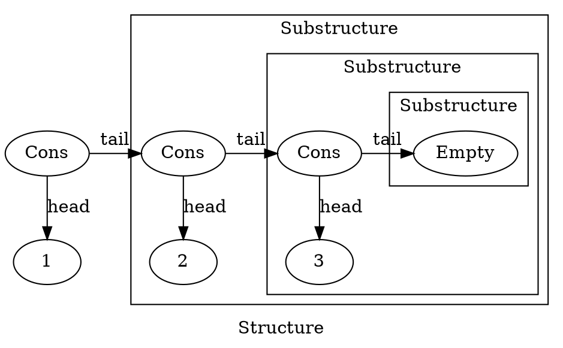
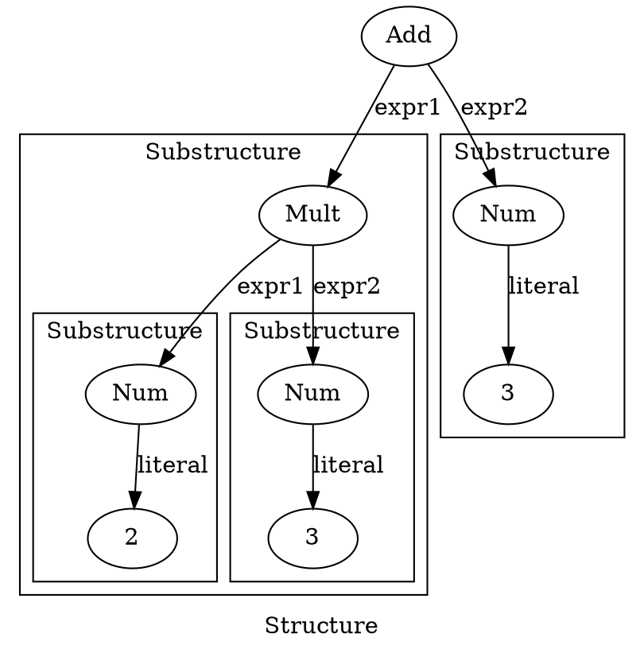

# Recursive data structures
In our daily programming life, we encounter recursive data structures on a regular basis. Most known examples include linked lists and trees. Often working with such data structures we have a need to evaluate (collapse) them to a value. For example: 

- Given a list of integers, say `1, 2, 3` one may want to find their sum - `6`.
- Given a parser of arithmetic expressions, such as `2 * 3 + 3`, we can expect it to produce a tree out of it - something like `Add(Mult(Num(2), Num(3)), Num(3))`. Such trees often need to be evaluated.
- A more abstract example: natural numbers. Given a zero and an ability to construct a successor of any natural number, you can construct all the natural numbers. If `Zero` is such a zero number, and `Succ(x)` constructs a natural number following `x`, `Succ(Succ(Succ(Zero)))` can represent `3`. This is also a recursive structure, and the simplest operation you can do on it is to actually evaluate it to an `Int`: `Nat => Int`.

In this article, we shall see how all of these examples involve recursive function calls. [DRY](TODO) - Don't Repeat Yourself - is one of the fundamental principles of programming - so, if we repeat recursion from example to example, we should abstract it away. We shall see how to do that.

But first, let us set the foundation by doing all of the above examples in code.

## Natural Numbers
Here is how a natural numbers implementation might look like:

```{.scala include="code/matryoshka-intro/src/main/scala/matryoshkaintro/C1NonDry.scala" snippet="NatDef"}
```

And here is a visualization of the number `3` represented this way:

```{.graphviz width=100%}
digraph G { label="Structure" rankdir=LR
  S3 [label="Succ"]

  subgraph cluster1 { label="Substructure" graph[style=solid]
    S2 [label="Succ"]

    subgraph cluster2 {
      S1 [label="Succ"]
      
      subgraph cluster3 {
        "Zero"
      }
    }
  }

  S3 -> S2 -> S1 -> Zero [label="previous"]
} 
```

Note the recursive nature of this structure: a smaller substructure of the same type is present in every structure (except the terminal one, `Zero`).

Now let us see how to evaluate a natural number to an `Int` - `Nat => Int` function. In order to do this for an arbitrary `Succ(x)`, we need to evaluate `x` and add `1` to the result. `Zero` should evaluate to `0`:

```{.scala include="code/matryoshka-intro/src/main/scala/matryoshkaintro/C1NonDry.scala" snippet="NatEx"}
```

## Lists
Now let us see how to implement a list in a recursive manner:

```{.scala include="code/matryoshka-intro/src/main/scala/matryoshkaintro/C1NonDry.scala" snippet="ListDef"}
```

A list is either an empty list or a recursive structure that has a `head` of some type and a `tail` - a sublist representing all the elements following the `head` in this list For simplicity, we use lists of `Int`.

Here is a visualization of how a list of `1, 2, 3` looks like:



In order to find a sum of all the elements of a list, we should add its `head` to the sum of all the elements of its `tail`. If the list is `Empty`, the result of the summation is `0`:

```{.scala include="code/matryoshka-intro/src/main/scala/matryoshkaintro/C1NonDry.scala" snippet="ListEx"}
```

## Expressions
Finally, this is the definition of a tree representing a mathematical expression:

```{.scala include="code/matryoshka-intro/src/main/scala/matryoshkaintro/C1NonDry.scala" snippet="ExprDef"}
```

We have two node types for the summation and the multiplication, and one leaf type for the numbers.

Here is how an expression `(2 * 3 + 3)` looks like:



How do we evaluate it? If it is a node representing a mathematical operation, first we need to evaluate its children and then do an operation denoted by this node. If it is a leaf - a number - it just evaluates to a number:

```{.scala include="code/matryoshka-intro/src/main/scala/matryoshkaintro/C1NonDry.scala" snippet="ExprEx"}
```