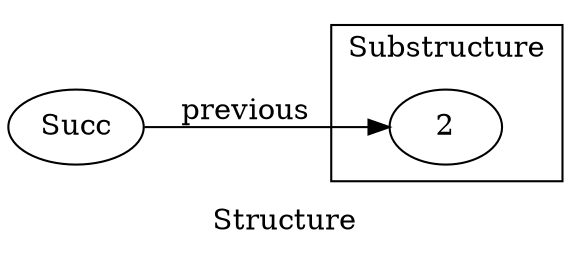
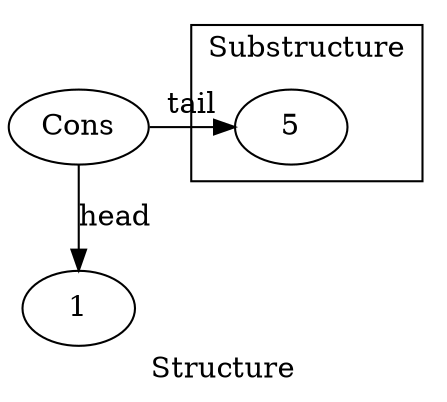
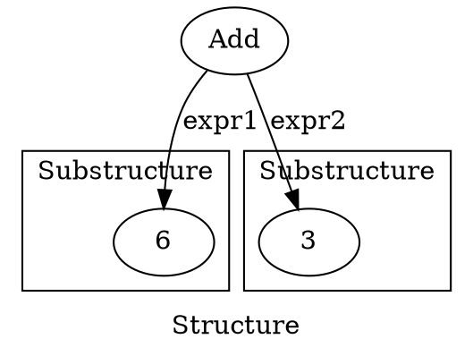

# Recursive data structures
In our daily programming life, we encounter recursive data structures on a regular basis. Most known examples include linked lists and trees. Often working with such data structures we have a need to evaluate (collapse) them to a value. For example: 

- Given a list of integers, say `1, 2, 3` one may want to find their sum - `6`.
- Given a parser of arithmetic expressions, such as `2 * 3 + 3`, we can expect it to produce a tree out of it - something like `Add(Mult(Num(2), Num(3)), Num(3))`. Such trees often need to be evaluated.
- A more abstract example: natural numbers. Given a zero and an ability to construct a successor of any natural number, you can construct all the natural numbers. If `Zero` is such a zero number, and `Succ(x)` constructs a natural number following `x`, `Succ(Succ(Succ(Zero)))` can represent `3`. This is also a recursive structure, and the simplest operation you can do on it is to actually evaluate it to an `Int`: `Nat => Int`.

In this article, we shall see how all of these examples involve recursive function calls. [DRY](TODO) - Don't Repeat Yourself - is one of the fundamental principles of programming - so, if we repeat recursion from example to example, we should abstract it away. We shall see how to do that.

But first, let us set the foundation by doing all of the above examples in code.

## Natural Numbers
Here is how a natural numbers implementation might look like:

```{.scala include="code/matryoshka-intro/src/main/scala/matryoshkaintro/C1NonDry.scala" snippet="NatDef"}
```

And here is a visualization of the number `3` represented this way:

```{.graphviz width=100% #nat_diagram}
digraph G { label="Structure" rankdir=LR
  S3 [label="Succ"]

  subgraph cluster1 { label="Substructure" graph[style=solid]
    S2 [label="Succ"]

    subgraph cluster2 {
      S1 [label="Succ"]
      
      subgraph cluster3 {
        "Zero"
      }
    }
  }

  S3 -> S2 -> S1 -> Zero [label="previous"]
} 
```

Note the recursive nature of this structure: a smaller substructure of the same type is present in every structure (except the terminal one, `Zero`).

Now let us see how to evaluate a natural number to an `Int` - `Nat => Int` function. In order to do this for an arbitrary `Succ(x)`, we need to evaluate `x` and add `1` to the result. `Zero` should evaluate to `0`:

```{.scala include="code/matryoshka-intro/src/main/scala/matryoshkaintro/C1NonDry.scala" snippet="NatEx"}
```

## Lists
Now let us see how to implement a list in a recursive manner:

```{.scala include="code/matryoshka-intro/src/main/scala/matryoshkaintro/C1NonDry.scala" snippet="ListDef"}
```

A list is either an empty list or a recursive structure that has a `head` of some type and a `tail` - a sublist representing all the elements following the `head` in this list For simplicity, we use lists of `Int`.

Here is a visualization of how a list of `1, 2, 3` looks like:

```{.graphviz #list_diagram}
digraph G { label="Structure" rankdir=TB newrank=true

  N3 [label="Cons"]
  L3 [label="1"]

  subgraph cluster1 { label="Substructure" graph[style=solid]
    N2 [label="Cons"]
    L2 [label="2"]
    subgraph cluster2 {
      N1 [label="Cons"]
      L1 [label="3"]
      subgraph cluster3 { Empty }
    }
  }
  {rank=same Empty N1 N2 N3}

  N3 -> N2 -> N1 -> Empty [label="tail"]

  N3 -> L3 [label="head"]
  N2 -> L2 [label="head"]
  N1 -> L1 [label="head"]
}
```

In order to find a sum of all the elements of a list, we should add its `head` to the sum of all the elements of its `tail`. If the list is `Empty`, the result of the summation is `0`:

```{.scala include="code/matryoshka-intro/src/main/scala/matryoshkaintro/C1NonDry.scala" snippet="ListEx"}
```

## Expressions
Finally, this is the definition of a tree representing a mathematical expression:

```{.scala include="code/matryoshka-intro/src/main/scala/matryoshkaintro/C1NonDry.scala" snippet="ExprDef"}
```

We have two node types for the summation and the multiplication, and one leaf type for the numbers.

Here is how an expression `(2 * 3 + 3)` looks like:

```{.graphviz #expr_diagram}
digraph G { label="Structure" rankdir=TB newrank=true
  Add

  subgraph cluster1 { label="Substructure" graph[style=solid]
    Mult
    subgraph cluster3 { Num1[label="Num"] Lit1[label="2"] }
    subgraph cluster4 { Num2[label="Num"] Lit2[label="3"] } 
  }

  subgraph cluster2 { label="Substructure" Num3[label="Num"] Lit3[label="3"] }

  {rank=same Mult Num3}

  Add -> Mult[label="expr1"]
  Add -> Num3[label="expr2"]

  Mult -> Num1[label="expr1"]
  Mult -> Num2[label="expr2"]

  Num1 -> Lit1[label="literal"]
  Num2 -> Lit2[label="literal"]
  Num3 -> Lit3[label="literal"]
}
```

How do we evaluate it? If it is a node representing a mathematical operation, first we need to evaluate its children and then do an operation denoted by this node. If it is a leaf - a number - it just evaluates to a number:

```{.scala include="code/matryoshka-intro/src/main/scala/matryoshkaintro/C1NonDry.scala" snippet="ExprEx"}
```

# Generalisation
## Structure preserving transformations
Intuitively, every example above is similar. All of them involve a recursive structure that is collapsed from the "bottom" (the terminal element with no child substructures) to the top. What is in common between the `natToInt`, `sumList` and `eval` functions? Can we abstract away these common elements, so that every one of these functions can be expressed in the same terms?

- Every example works on a **recursive structure - a structure that has substructures** of the same type as parts of itself.
- They all involve **recursive calls in order to transform these substructures**. So, `natToInt` is called recursively on `previous` in order to evaluate `Succ(previous)`.
- **The results** of these transformations **are combined according to the parent structure**.
  - In `sumList( Cons(head, tail) )`, `head` is a part of the parent structure. `tail` is a substructure that is evaluated recursively via `sumList(tail)` and then combined with that `head` via addition.
  - In `eval` of either `Add` or `Mult`, we first need to call `eval` on the child expressions of these nodes, and then combine them depending on the parent structure - if it is `Add`, we do addition, if `Mult` - multiplication.

A better way to look at it is as if we were replacing the substructures by their evaluations and then evaluating the resulting structure.

For example, when evaluating a `Nat` depicted on [this](#nat_diagram) diagram, the next step of its evaluation would look as follows:



Effectively, we have `Succ(previous = 2)`, which is then collapsed into `1 + 2` == `3`. However, `previous` is supposed to be a `Nat`, not an `Int`. In order to be able to write the above statement, we can **allow the substructure be of an arbitrary type**: `Succ[A](previous: A)`.

Similarly, the next step for [this](#list_diagram) `IntList` will be:



This is effectively a `Cons[Int](head = 1, tail = 5)` (again, notice how we introduce a type parameter for the substructure). After that, the `head` is added to the new `tail`, resulting in `6`

Finally, for [this](#expr_diagram) `Expr`, the next step is to evaluate both of its two recursive substructures:




This is an `Add[Int](expr1 = 6, expr2 = 3)`, and the next step is to collapse it by doing `6 + 3`.

All in all, we are dealing with the **structure preserving transformations** here. Probably you have already recognized how the above job can easily be done with functors.

If we redefine our recursive structures so that they are parameterized by the type of their substructure, their types will have a form `F[A]` and we will be able to define functor instances for them.

Ordinarily `A` in that `F[A]` is another `F[_]` - a substructure - reflecting the recursive nature of that structure. In our examples, we first do a `map`, turning `F[A]` into `F[B]`, where `B` is the type we are evaluating the structure into (in all our examples, `B` is `Int`). Next, given `F[B]`, we collapse it into a `B`. A function `F[B] => B` is called an *Algebra*.

Now let us see how this theory can be applied in practice.

## New definitions for the recursive structures
In all our data structures, we need to specify the type of the substructures as a type parameter, so that we can then evaluate these substructures in a way that preserves the parent structure, via `map`.

The new definitions can go as follows:

```{.scala include="code/matryoshka-intro/src/main/scala/matryoshkaintro/C2Generalisation.scala" snippet="Defs"}
```

## Functors
If we want to use `map` on these data structures, they need functors. The definitions below are straightforward (do not forget to `import scalaz._, Scalaz._`):

```{.scala include="code/matryoshka-intro/src/main/scala/matryoshkaintro/C2Generalisation.scala" snippet="Functors"}
```

## Catamorphism: first attempt
As discussed above, all we need to collapse a recursive structure is to map its substructures by the collapse function and then evaluate the resulting structure via an algebra. This recursion scheme is called a *catamorphism*[^1]. Let us try to define it:

```{.scala include="code/matryoshka-intro/src/main/scala/matryoshkaintro/C2Generalisation.scala" snippet="CataWrong"}
```

There is one problem with this code, however. In a recursive structure, `T` is supposed to be of the same type as `F[T]` by definition. Or else we will not be able to map it by `cata` as above, since `cata` will need a `Functor[T]`. In other words, `F[T] == T`. If so, we should also be able to write `structure: T` instead of `structure: F[T]` in the signature. Obviously, we can not have that in Scala, so what do we do?

[^1]: TODO

## Fixed point types
### Theory
A [fixed point](https://en.wikipedia.org/wiki/Fixed_point_(mathematics)) of a function `f(_)` is a value `x` such that `f(x) == x`. We can think of a higher-order function `fix` that computes a fixed point of its argument: `fix(f) == x` such that `f(x) == x`. Or, in other words, `fix(f) == f(fix(f))`.

What if we bring the same ideas to the type theory? By analogy, a *fixed point type* of a higher-kinded type `F[_]` is some type `T` such that `F[T] == T` - precisely what we need. We can also have a type `Fix[_[_]]`, such that `Fix[F] == F[Fix[F]]`.

Fixed point types are interesting, because they can represent a recursive structure of any depth desired as a single type:

```scala
Fix[F] == F[Fix[F]] == F[F[Fix[F]]] == ...
```

### Practice
I am not aware of the way you can define `Fix[_[_]]` so that the above equality holds - the compiler will think `F[T] != T` for any `F` and `T`, as far as I know.

It is possible to think of a workaround, though. In our `cata` definition above, we need to know that `F[T] == T` so that we can treat `T` as if it was `F[T]`. So in practice, we do not need to convince the compiler in that equality - a simple function `T => F[T]` is enough.

We can emulate the fixed point type computation as in the theory above as follows:

```{.scala include="code/matryoshka-intro/src/main/scala/matryoshkaintro/C2Generalisation.scala" snippet="Fix"}
```

So we just wrap an `F[_]` in this case class. `Fix[F] => F[Fix[F]]` can be defined as simply `fix => fix.unfix`.

## Catamorphism: second attempt
Now we can define the catamorphism on the fixed point type of a structure `F` as follows:

```{.scala include="code/matryoshka-intro/src/main/scala/matryoshkaintro/C2Generalisation.scala" snippet="CataRight"}
```

## Examples using `cata`
Now we can use the new `cata` to define our examples:

```{.scala include="code/matryoshka-intro/src/main/scala/matryoshkaintro/C2Generalisation.scala" snippet="Examples"}
```

First thing that catches the eye, probably, is how we need to embed every layer of the recursive structures into `Fix`. This is ugly, but fine as for the proof of concept.

Notice how all of the examples are now expressed in terms of one function - `cata`. We have successfully abstracted the common parts of the recursive structure collapse task.

Also, notice how we have gotten rid of the recursive calls in all of our tasks. The recursion is now abstracted away in `cata`, so that the user does not need to deal with it directly.